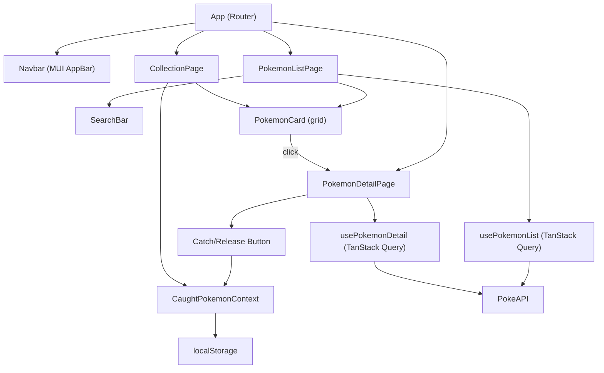

# Pokedex App -- Implementation Plan

## Key Technology Choices

- **React 18 + Vite + TypeScript** -- fast setup, modern tooling
- **Material UI (MUI)** -- satisfies the bonus requirement and gives a polished look quickly
- **TanStack Query (React Query)** -- handles data fetching, caching (bonus), loading/error states with minimal boilerplate
- **React Router v6** -- client-side routing for list and detail views
- **localStorage** -- persists the caught collection across browser sessions (justified: survives tab close, unlike sessionStorage)
- **Vitest + React Testing Library** -- for basic unit tests (bonus)

## API Strategy (Avoiding Unnecessary Calls)

The PokeAPI list endpoint (`/api/v2/pokemon?limit=151`) only returns `{ name, url }`. Instead of fetching 151 individual detail endpoints just for the list view, we can **derive the sprite URL directly from the Pokemon ID** extracted from the list URL:

```
https://raw.githubusercontent.com/PokeAPI/sprites/master/sprites/pokemon/{id}.png
```

This means the **list view requires exactly 1 API call**. Full detail is only fetched when the user clicks into a Pokemon (1 additional call per detail view). TanStack Query caches these so revisiting a Pokemon doesn't re-fetch.

For **search**, we fetch all names in a single call (`?limit=1500`) and filter client-side. This is fast because the list payload is small (just names + URLs).

## Folder Structure

```
src/
  api/            -- API client + query hooks (usePokemonList, usePokemonDetail)
  components/     -- Reusable UI: PokemonCard, SearchBar, TypeChip, Layout/Navbar
  context/        -- CaughtPokemonContext (React Context + localStorage)
  pages/          -- PokemonListPage, PokemonDetailPage, CollectionPage
  types/          -- TypeScript interfaces (Pokemon, PokemonListItem, etc.)
  theme/          -- MUI theme configuration
  App.tsx         -- Router setup
  main.tsx        -- Entry point
```

## Routing


| Path           | Page              | Description                            |
| -------------- | ----------------- | -------------------------------------- |
| `/`            | PokemonListPage   | Searchable grid of Pokemon             |
| `/pokemon/:id` | PokemonDetailPage | Name, large image, types, catch button |
| `/collection`  | CollectionPage    | Grid of caught Pokemon                 |


## Core Architecture




## Implementation Steps (Time-Boxed)

### Phase 1 -- Project Setup (~15 min)

- Scaffold with `bun create vite@latest . -- --template react-ts`
- Install deps: `@mui/material @emotion/react @emotion/styled @tanstack/react-query react-router-dom`
- Install dev deps: `vitest @testing-library/react @testing-library/jest-dom jsdom`
- `git init` + initial commit
- Configure MUI theme (a simple Pokedex-inspired red/dark palette)

### Phase 2 -- Types + API Layer (~20 min)

- Define TypeScript types in `src/types/pokemon.ts`:
  - `PokemonListItem { name: string; id: number; spriteUrl: string }`
  - `PokemonDetail { id, name, sprites, types, height, weight, abilities, stats }`
- Create `src/api/pokemonApi.ts` -- raw fetch functions
- Create `src/api/hooks.ts` -- `usePokemonList()` and `usePokemonDetail(id)` using `useQuery`

### Phase 3 -- List View + Search (~40 min)

- Build `PokemonListPage` with MUI `Grid`, `TextField` for search, `CircularProgress` for loading
- Build `PokemonCard` component: shows sprite + name, clickable (navigates to detail)
- Implement client-side search filtering by name
- Add pagination via "Load More" button or infinite scroll (use `offset`/`limit` params with `useInfiniteQuery`)

### Phase 4 -- Detail View (~30 min)

- Build `PokemonDetailPage`: fetches full detail via `usePokemonDetail(id)`
- Display: large official artwork, name, types (as colored chips), height, weight, abilities, base stats
- Add "Catch" / "Release" button wired to context

### Phase 5 -- Caught Collection (~30 min)

- Create `CaughtPokemonContext` with `useCaughtPokemon` hook
- On mount, read from `localStorage`; on every change, write back
- Store minimal data: `{ id, name, spriteUrl, types }` to avoid re-fetching
- Build `CollectionPage`: displays caught Pokemon in a grid using the same `PokemonCard`
- Include "Release" functionality (remove from collection)

### Phase 6 -- Polish + Responsive (~20 min)

- Responsive grid breakpoints (xs=6, sm=4, md=3 columns)
- MUI `AppBar` with nav links (Pokedex / My Collection) + Pokemon count badge
- Error/empty states (no results found, empty collection)
- Type-based color chips (fire=red, water=blue, etc.)

### Phase 7 -- Tests + README (~20 min)

- Unit tests: PokemonCard render, search filtering logic, CaughtPokemonContext add/remove
- Write README: setup instructions, architecture overview, storage justification, AI usage notes

### Phase 8 -- Deploy + Final Commits (~15 min)

- Deploy to Vercel (`bunx vercel --prod`) or Netlify
- Clean up commit history (ensure meaningful commit messages throughout)
- Final review pass

## Key Design Decisions to Justify in README

- **localStorage over sessionStorage**: The collection should persist across sessions. Users expect their caught Pokemon to still be there when they return. sessionStorage would lose data on tab close.
- **TanStack Query**: Provides built-in caching (avoids re-fetching), automatic retry, loading/error state management -- all requirements of the challenge with minimal code.
- **Client-side search**: With ~1500 Pokemon names being small data, fetching once and filtering client-side is more responsive than server-side search (PokeAPI has no search endpoint anyway).

## Commit Strategy

Make small, meaningful commits at each phase boundary:

1. `chore: scaffold vite + react-ts project with dependencies`
2. `feat: add API layer with TanStack Query hooks and Pokemon types`
3. `feat: implement Pokemon list view with search and pagination`
4. `feat: add Pokemon detail view with type display`
5. `feat: implement caught Pokemon collection with localStorage persistence`
6. `style: polish UI with MUI theme, responsive grid, and type colors`
7. `test: add unit tests for components and context`
8. `docs: add README with setup, architecture, and AI usage notes`

